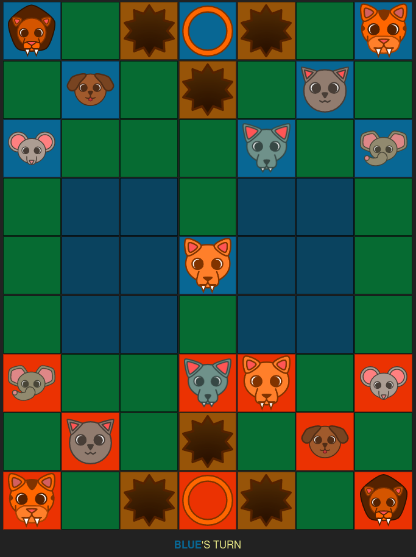

# Jungle Chess Web

Play jungle chess in your browser - local or vs an AI.

Play [here](https://arnemileswinter.github.io/jungle-chess-web) on github pages.

This toy project is the first time for me using wasm-bindgen with rust.

The project uses my [jungle-chess engine written in rust](https://github.com/arnemileswinter/jungle-chess), ported to wasm.
